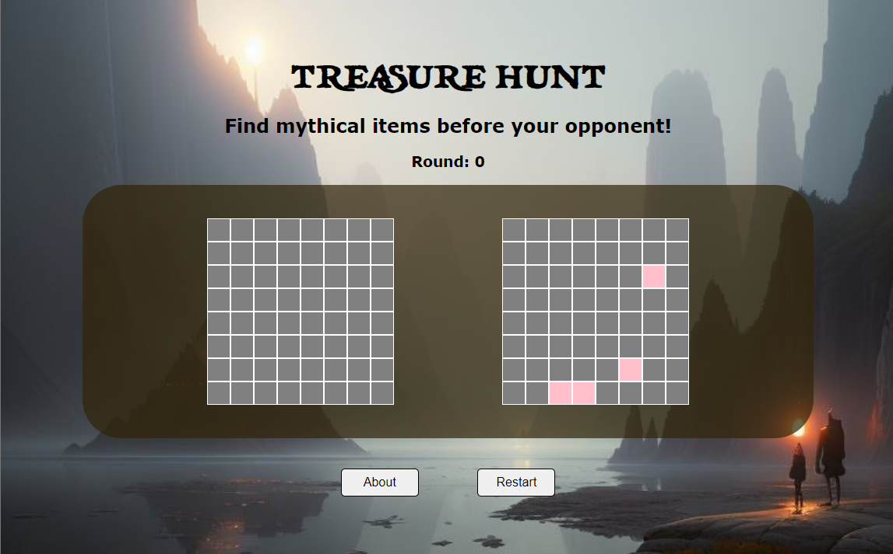

# Treasure Hunt

## About

Treasure Hunt is a simple-battleship style game made using vanilla javascript, CSS, and HTML. 

There are four hidden "treasures" which are randomly assigned a location on each player's map (an 8x8 grid). If a treasure is appropriately found, the box will change color and be marked with an "X". 

## Story

You are a treasure hunter and are racing against other treasure hunters (computer) to find the buried treasues first. Legend has it that these 4 fabled objects are hidden in the grounds:

    - Philosopher's stone 
    - Pot of gold at the end of the Rainbow
    - King Arthur's Sword
    - Davy Jones chest

These grounds are magical and where these items are hidden are different for every person.
Can you find them all first?

## Gameplay

* There are two gameboards. One that the player "sees" and the other that the computer "sees"

* Each round consists of the player making a selection on their map, followed by the computer making a selection on it's map. 

- If an item is found, the box in which it was found will be marked with an "X"
- If an item is not found, the box will change color. 
- Neither player can select the same box twice.

* After each round, the program checks to see if all the items have been found.  

## Future Developments

This project is currently playable, but remains under development.The following features are expected to be added:

* background images, displaying the found objects
* high contrast accessibility button
* using the "enter" button to automatically select a grid location
* adding squares that when uncovered, will allow you to "stop time" and give you and extra turn
* varying sizes of the trasures

### Thanks for visiting!

I hope you enjoy this little game as much as I have enjoyed making it. 
